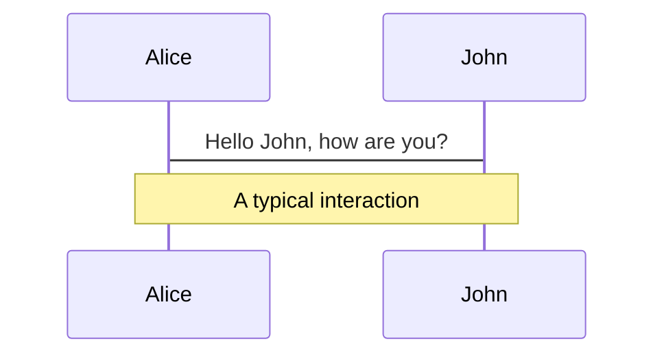
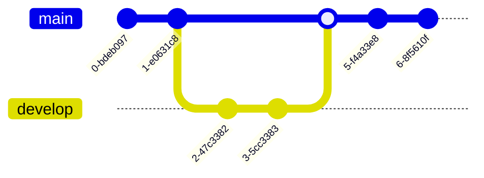

---
layout: cover
background: 'https://s1.ax1x.com/2022/06/10/X6zfVf.png'
---

# cover

使用cover的layout并且设置background属性

---
layout: default
---​

# 代码

部分高亮，下一页高亮有变化（动画）
```ts {2-3|5|all}
function add(
  a: Ref<number> | number,
  b: Ref<number> | number
) {
  return computed(() => unref(a) + unref(b))
}
```
可在线编辑器
```ts {monaco}
console.log('HelloWorld')
```

---

---
layout: default
---​
# 静态资源

远程资源,第一次运行时会把它们缓存到磁盘中


本地资源需要放在public 文件夹下，用.直接索引到public文件夹 -->


---

---
layout: default
---​
# 图标
可以使用所有主流的icon pack

 Material Design Icons:
<mdi-wifi />mdi:wifi

Twitter Emoji:<twemoji-1st-place-medal />

<uim-rocket />
<uim-rocket class="text-3xl text-red-400 mx-2" />
<uim-rocket class="text-3xl text-orange-400 animate-ping" />

更多图标直接参阅https://icones.js.org/
___

---
layout: default
---​

# 公式
内联公式和块公式，基于KaTex

可以使用内联公式 $1+1=2$

当然也可以使用块公式
$$
\begin{array}{c}

\nabla \times \vec{\mathbf{B}} -\, \frac1c\, \frac{\partial\vec{\mathbf{E}}}{\partial t} &
= \frac{4\pi}{c}\vec{\mathbf{j}}    \nabla \cdot \vec{\mathbf{E}} & = 4 \pi \rho \\

\nabla \times \vec{\mathbf{E}}\, +\, \frac1c\, \frac{\partial\vec{\mathbf{B}}}{\partial t} & = \vec{\mathbf{0}} \\

\nabla \cdot \vec{\mathbf{B}} & = 0

\end{array}
$$

---
layout: center
---

# 图表
mermaid 





---

---
layout: default
---

# Windi class
css

<style>
.box {
  @apply
    py-8 px-8 inline-flex mx-auto
    bg-white dark:bg-gray-400 dark:bg-opacity-10
    rounded-xl shadow-md;
}
.btn {
  @apply
    px-4 py-1 text-sm text-purple-600 font-semibold
    rounded-full border border-purple-200 dark:border-purple-800
    hover:text-white hover:bg-purple-600 hover:border-transparent
    focus:outline-none focus:ring-2 ring-purple-600 ring-opacity-40;
}

</style>
<div class="flex">
  <div class="box">
    <div class="text-center space-y-2">
      <div class="space-y-0.5">
        <p class="text-lg text-black dark:text-white font-semibold mb-2">
          Erin Lindford222
        </p>
        <p class="text-gray-500 dark:text-gray-300 font-medium pb-3">
          Product Engineer
        </p>
      </div>
      <button class="btn">
        Message
      </button>
    </div>
  </div>
</div>